# Daily Journal

## January 5th & 6th

Today I did a bearing fit test for my legs so that I made sure I had the right diameter for a pressfit. I took the exact outer diameter (21 mm) and subtracted and added .25mm multiple times to test the different bearings. After milling I determined an outer diameter of 21.525mm was the perfect fit.

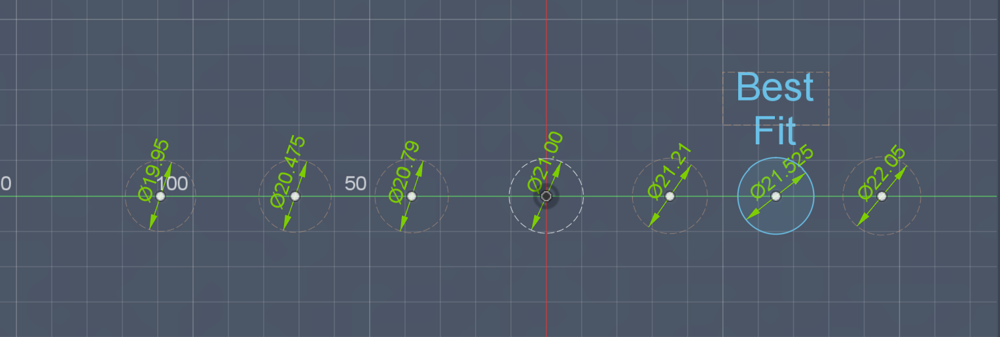

## January 7th & 8th

Today I started a new sketch in Fusion 360 for my grounds. I decided to make larger holes in the grounds than I did before in order to cut off unesscessary weight that would put more load on the motor. I also added the slot holes that I would make 3D printed parts for eventually to connect each ground. For the middle I made sure to make a bearing shelf and a bearing through hole. By checking with my 3D model, it was easy to determine the height I would need for the grounds and how far out the slot holes would have to be so that the grounds would not interfer with the linkages.

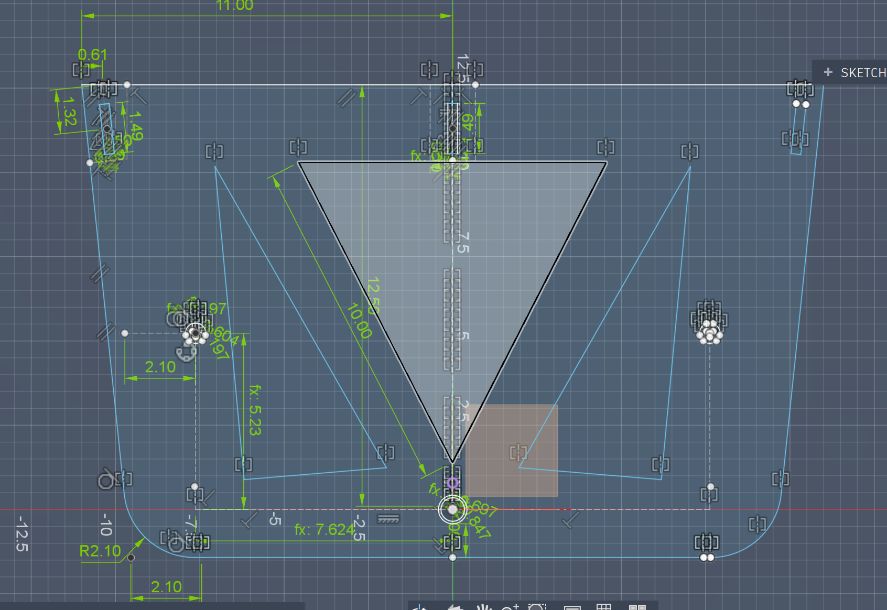

## January 9th & 12th

Today I decided to work on the 3D printed parts that would connect the grounds. By using the grounds I made yesterday as a schematic, I created the grounds.

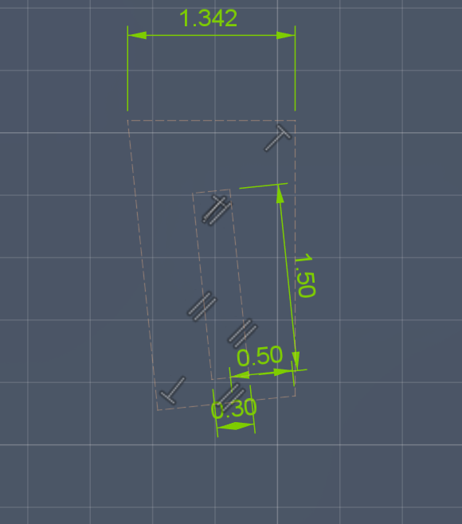

I then took this into a new file to create the 3D model. I had to make one for the end sides and one for the middle sides so that they can all fit together (the parts that go into it had to be full length and half length of wood and some had to be only half length).

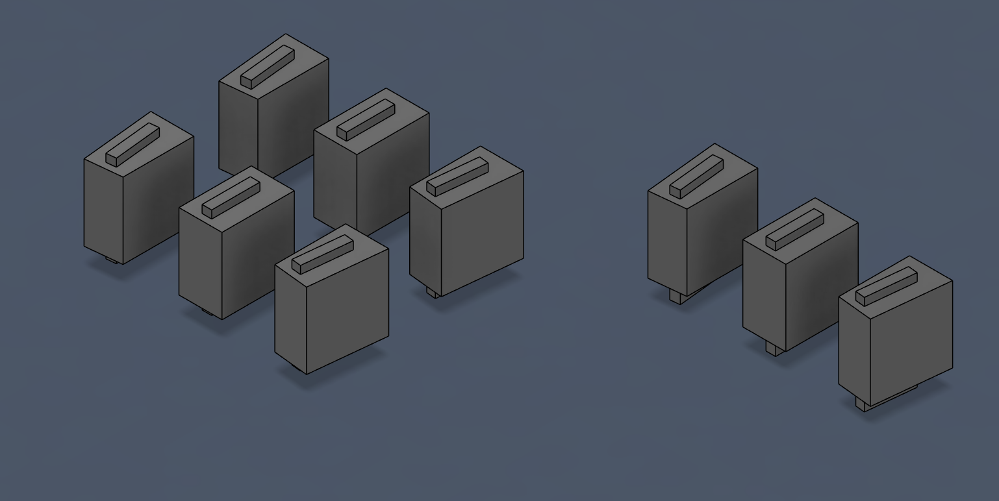

## January 13th & 15th

Looking at the Concept Bytes files, I decided to go with a 3D printed crankshaft as it would make it much easier for the legs to be at the correct phase and would make the issues that we had with the motor flanges go away. In order to create the flange I had to design the three pronged axle. I did this by creating an outer circle that was the thickness of the inner diameter of the bearings and then creating another circle conecntric to it that is a third of the length. I then created a chord that was a third of the diamter that was horizontal. From this I created two lines going out from each end of the chord chord tangent to the inner circle and made a circle pattern that repeated 3 times and forced the repeats of the lines to be coincident. 

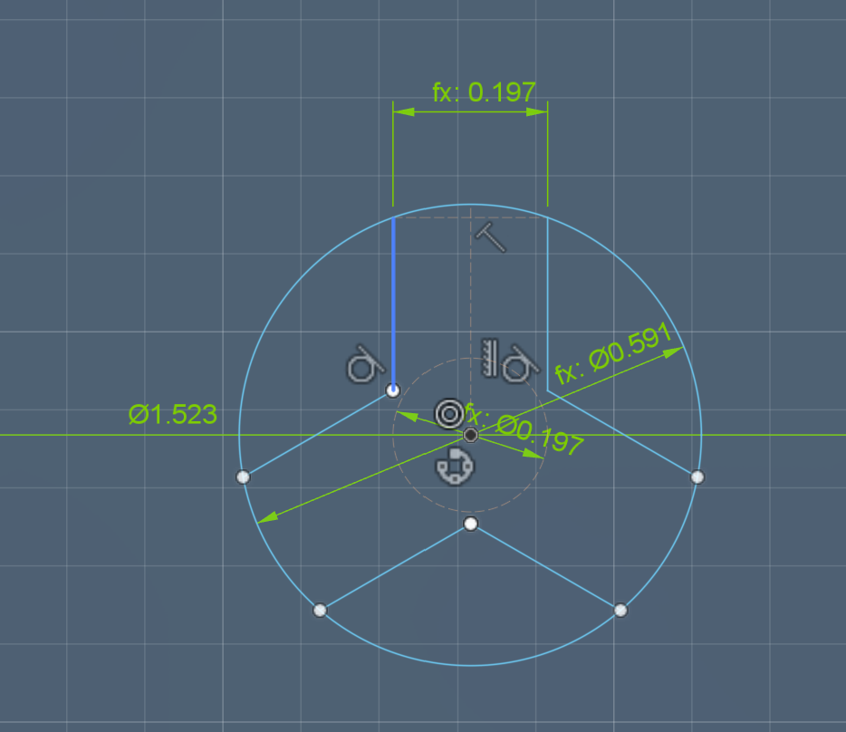

## January 20th

From this I created the axles and part of the motor shaft. I needed this axle to be able to be for the part that connected to each ground, the part that connected each crankshaft piece, the part that connected each linkage, and the part that was at the end of the half table. 

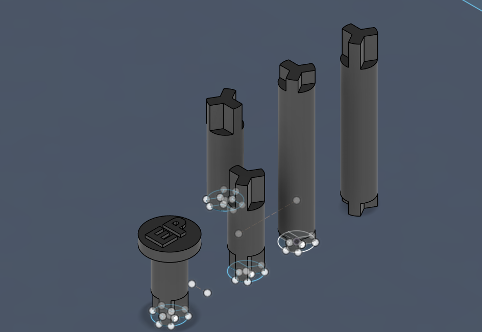

## January 21st & 22nd

Using the design I made the crankshaft pieces. The part of the crankshaf that didn't connect to the motor were simple, but for the motor I needed to allow space for the d-shaft and an inset screw so that I can fasten the crankshaft to the motor.

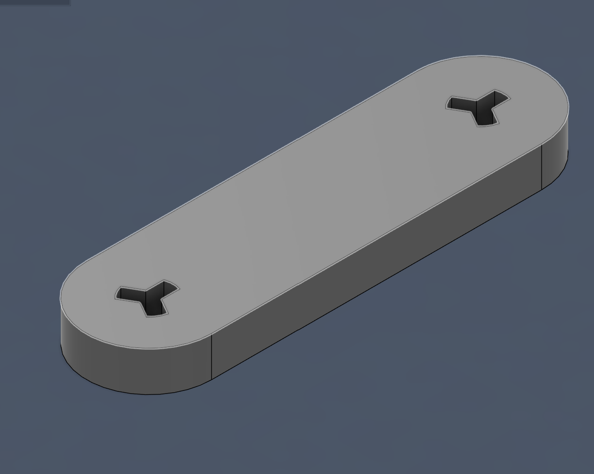

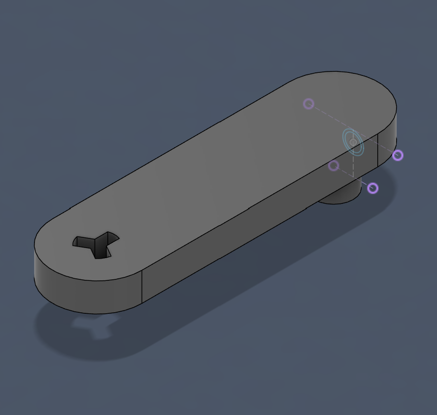

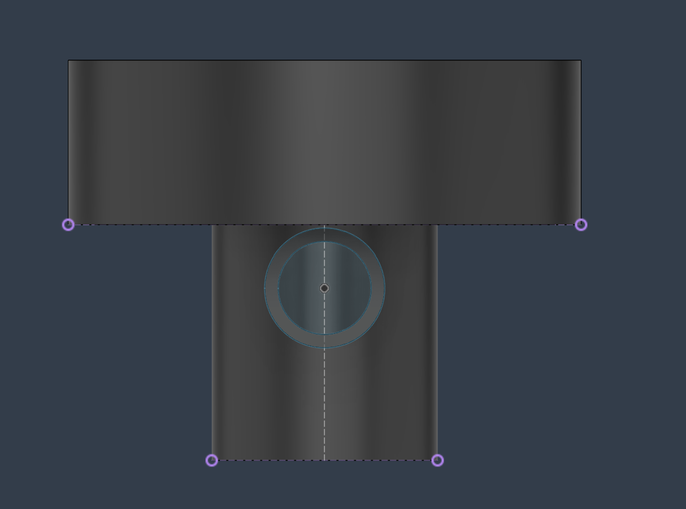

## January 23rd & 26th

Today I created a spacer so that the legs wouldn't interfere with the ground which was a problem in our last iteration. This required me to change the axle 3D prints as well so that they were the correct lengths.

## January 27th - 30th

For the grounds, since they were milled and not 3D printed, I needed to do another fit test for them so that they would press fit with my 3D printed axles. I wasn't sure what exactly I should change for the file to make it fit so I decided to ask Claude which told me to just change the outside circle diamter. With this I determined the best fit for the axles had an outside diameter of 0.604'' With this I changed the ground sketch design so it matched with my fit test.

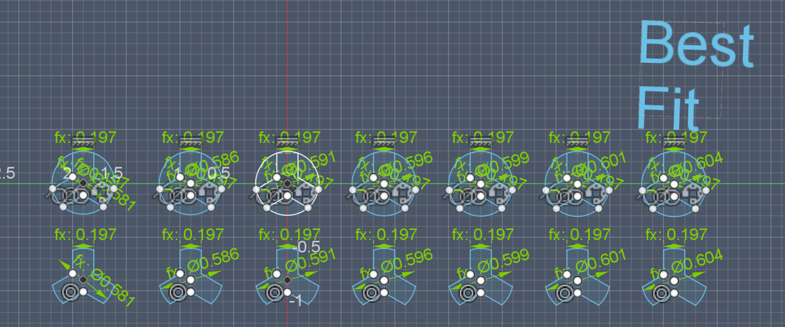

## Febuary 2nd

Today I designed my ground that would connect to my motor. This design wasn't much different from my other ground execpt for the fact that I had to add holes for the motor screws with a bolt ledge so that I can fasten my motor to the ground.

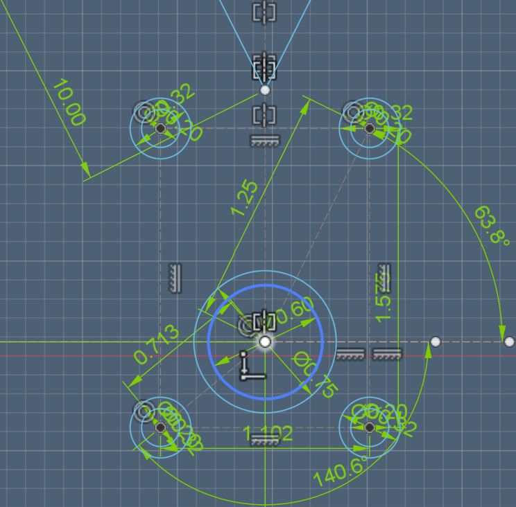

3rd - test fit for connected ground 3d prints

4th & 5th - 3D pritned

6th & 9th - redesigned leg files to include bearing changes and take off extra weight off feet

11th & 18th - designed file for mill one set of legs and other full files

19th - milled

20th - remilled for half pieces

23rd - glued and sanded

24 - 25th - messed around with motor flange to make sure it would fit on the shaft

26th - milled the rest of my pieces

