# Walking Table

This is a project by Evan Park and David Vaughn to create a walking table, inspired by [The Carpentopod](https://www.decarpentier.nl/carpentopod) by Niel de Carpentier. This project is also inspired by [The Strandbeest sculptures](https://www.strandbeest.com/) by Theo Jansen where our leg design is derived from. The end goal of the project is to have a table that can walk, similar to The Carpentopdo, but also be able to utilize a camera to respond and navigate their enviorment. The hope is that the table could have actions where it could see a person or thing in the camera and respond mechanically.

## Task List

You can find my task list [here](https://docs.google.com/document/d/1pdYfZHLqmD0I9hMA4ECjzsxxwRmnwLk_HRpnbSTHKo8/edit?usp=sharing)

## Other Documentation

The documentation that I created for the project while working on it during October 2024 - April 2025 can be found [here](https://sites.google.com/charlottelatin.org/evan-park/home/bioengineering/the-walking-table)

## Overview

### Design Specifications

The table will be about 12x48'' and about 12'' tall. It will be made primarily of wood, but there will be PLA and Aluminum used in some of the jointery. It will have a living hinge to conceal the electronics (two high torque motors and a Raspberry Pi). The Raspberry Pi will have a camera sensor to analyze it's enviorment. 

### Materials List

| Walking Table 2025 Bill of Materials (BOM) |
| ------------------------------------------ |
| Name:                                      | Evan Park | Period | A |  |  |  |  |
| Project Title                              | Walking Table |  |  |  |  |  |  |
| Item #                                     | Description | Vendor | Part Number | Qty | Cost | Link to Where to Purchase |  |
| ,5'' 96x48 Plywood                         | To CNC into legs and frame | Home Depot |  | 3 | $136.50 | [https://www.homedepot.com/p/SANDEPLY-12mm-Sande-Plywood-1-2-in-Category-x-4-ft-x-8-ft-Actual-0-472-in-x-48-in-x-96-in-454532/203414055](https://www.homedepot.com/p/SANDEPLY-12mm-Sande-Plywood-1-2-in-Category-x-4-ft-x-8-ft-Actual-0-472-in-x-48-in-x-96-in-454532/203414055) |  |
| 3/8''_5/8'' Shoulder Bolt                  | For joints | Amazon |  | 10 | $17.00 | [https://www.amazon.com/Socket-Shoulder-Screws-Bolts-25MM/dp/B009TE1K4S](https://www.metalsdepot.com/aluminum-products) |  |
| 5mm Aluminum Rod                           | For crankshaft | Metals Depot |  | 4ft | $20.00 | [https://www.metalsdepot.com/aluminum-products](https://www.metalsdepot.com/aluminum-products) |  |
| F625ZZ Flanged Bearings                    | 5mm ID, 16mm OD | Amazon |  | 18 | $14.00 | [https://www.amazon.com/uxcell-Flange-Bearing-Shielded-Bearings/dp/B08CK6LM8Q](https://www.amazon.com/uxcell-Flange-Bearing-Shielded-Bearings/dp/B08CK6LM8Q) |  |
| 5mm Shaft Collars (Set Screw)              | To keep crankshaft from sliding | Amazon |  | 10 | 15$ | [https://www.amazon.com/Ruland-MSC-5-F-Screw-Collar-Metric/dp/B0063KWEDW](https://www.amazon.com/Ruland-MSC-5-F-Screw-Collar-Metric/dp/B0063KWEDW) |  |
| 12V DC Geared Motor (20-50 RPM)            | High torque, low RPM geared motor. 20-50 RPM ideal for walking speed | Amazon |  | 2 | $80.00 | [https://www.amazon.com/Electric-Torque-Reduction-Centric-Output/dp/B0728HDH45](https://www.amazon.com/Electric-Torque-Reduction-Centric-Output/dp/B0728HDH45) |  |
| Raspberry Pi 5 4GB                         | For computing the visual inputs | Adafruit |  | 1 | $77 | [https://www.adafruit.com/product/5812](https://www.adafruit.com/product/5812) |  |

#### Final Estimate

The final estimate is $359.50 

### Machines, Software, and Tools

The machines I will be using to create the walking table will be primarily the ShopBot. I might end up using other tools to create the legs but the main machine I will be using will be the ShopBot. I will occasionally use the bandsaw and sander to smooth and shape the legs if needed. 

Fusion360 and Aspire will be the main softwares I will be using to design and cut my legs. I will design my files parametrically in Fusion360 and take the dxf files into Aspire to create the toolpaths for the ShopBot.

The tools I will need for this project is a bolt fastener for the joints, hex nut fasteners for the motor flanges, and wood glue to put together the layers for each leg. 

## 3D Motion Model

From our physical prototype, there seemed to be an issue with the amount of force the legs are producing in order for the table to walk and the smoothness of the motion. By smoothness, parts of the walk cycle would go faster than normal when suspended in the air. This issue could be due to the effect of gravity assisting on portions of the cycle while being a detriment on other parts. In order to find the cause of this. We decided to put together a motion model of our pieces to make sure there aren't any issues that are tied to the CAD design of the legs. If we don't find any issues with the model, we can assume it is a assembly issue. Luckily, we put together some 3D models of each piece of the leg so creating the 3D model of the entire leg was simple. 

In Fusion 360, I put the pieces together in separate components.

### Single Leg (September)

Then I started on working on trying to make the model. I made a revolving joint where the jimmy is placed and attempted to ground the part of the thigh that needed to be grounded. I had a lot of issue with trying to get the model to work.

I then learned that both grounds for the the leg needed to be a revolute joint type and be pinned so that they cannot move. This allowed the single leg to work.

https://github.com/user-attachments/assets/0f659eb2-71fe-4b76-a008-0f084a4013fa

### Double Leg (October 1st - 15th)

The double leg required me change the single leg file a little bit so that the pieces that connect to the motor can all fit. Using the single leg motion file, I was able to easily create a second leg by mirroring the components across the middle of the leg. I then constrained the mirrored components and added the joints the same way that I did for the single leg.

https://github.com/user-attachments/assets/6a0d1ccd-b37a-4eaf-acc6-456f574038d4

### Half-Table (November-December 10th)

Making the half table was more complicated than I expected. I thought the process would be as simple as copy and pasting the double leg twice and adding more joints but I kept running into problems.

#### Grounding & Reworking Crankshaft

There was a few issues with grounding my pieces at first. Deleting my grounds that I had previously would require me to unlink my pieces to the design I had made for them which would create issues later down the line. To fix this, I had to recreate the legs with new grounds. Before I did this, I had to tackle another issue.

The crankshaft was creating problems when I tried to connect each individual piece together. To fix this, I designed the entire cranksahft and imported it into the file. I then rebuilt the legs which was a much easier process once I had fixed these two things.

https://github.com/user-attachments/assets/64f976b2-2913-4219-aeee-ac5f481f202a

## Reworking Design (December)

Now that I know that our design works theoretically, I wanted to make a few changes to the design. Because our design should be working, that means that there has to be a problem with how we are assembling the table. One of the most obvious problems would be our crankshaft. The first step to fixing this issue being is to add bearings again. I reasoned that the only spots that needed bearings were the crankshaft and where the grounds connect because this is were most of the load on the table legs go so improving these joints would make the leg turn much smoother. With the changes I want to make known I can find my materials required to develop the project. 

Another piece that I would want to rework is our D-Shafts. During testing last year, I understood that our D-shafts would deform and not fully stay in place. Now that I am adding bearings, I can attempt to use aluminum shafts for the connections to the crankshaft. This could potentially solve our issue because the shafts would be much more robust leading to less issues with the amount of load our crankshaft can handle. 

## New Leg Design - Fusion 360

### Feet Diamter

One of the first things I noticed when I started designing the new legs was that the feet diameter, how thick the feet were which affected at what point it would touch the ground, was off. After rescaling the parameter that decided this, I had to reconstrain some pieces that changed due to the new diameter. Once this was done I started on some other changes.

### Taking Weight Off

Another change I wanted to make was taking weight off of the design. Due to changing the diameter, the weight was already changed pretty drastically. But, I decided to take some weight of the feet by adding an offset to the edge where I could cut the offset out in order to take away material that wasn't needed in order for the design to function properly. I decided to do this for only the feet.

### Adding Bearings

I wanted to do a new design with berings incooperated. I knew that not every piece required the addition of bearings, only the parts that connect to the crankshaft and the parts that connect to the crankshaft and the parts that connect to the grounds because those were the parts that took on the most load.

I wanted to have the bearings be press fit into the wood pieces so before added it to the CAD file, I did a bearing fit test for my legs so that I made sure I had the right diameter for a pressfit. I took the exact outer diameter (21 mm) and subtracted and added .25mm multiple times to test the different bearings. After milling I determined an outer diameter of 21.525mm was the perfect fit with a depth of 15''. 

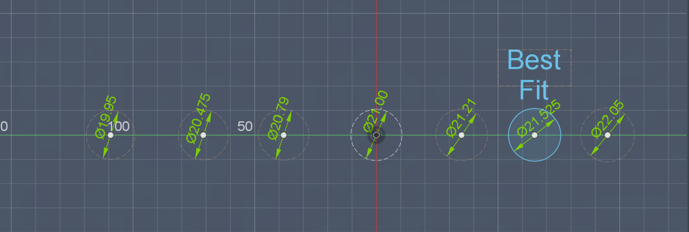

Now that I had the dimensions, I added bearings to the thigh and each of the pieces that connected to my crankshaft. Now that this was done, I had my final linkage design.

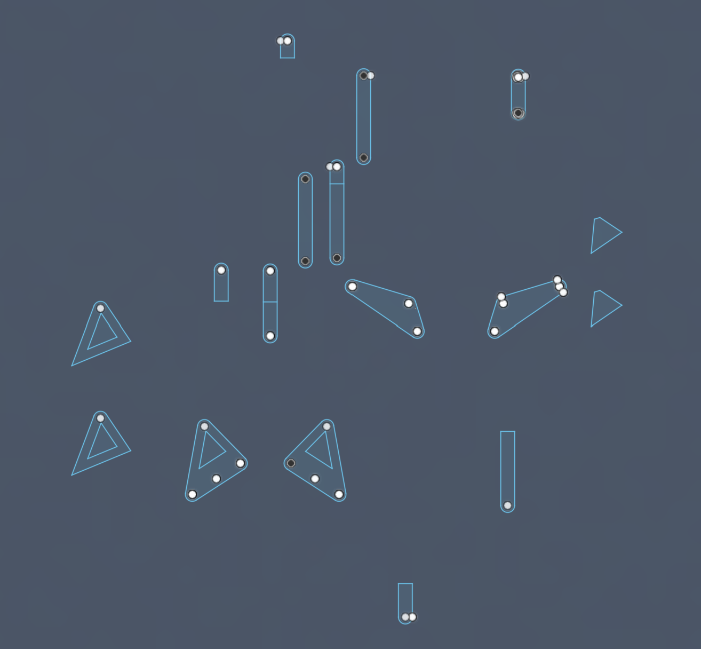

## Crankshaft

Now that I had bearings in my design, I decided to redesign the crankshaft in order to accomidate these bearings

After looking at the Concept Bytes Walking Table V3, which also included bearings, I decided to replicate their crankshaft design which was 3D printed. There were a few advantages to going with this route but there were also some tradeoff. Some of the advantages was that if the pieces held up and did not break, it was certain that the crankshaft wouldn't mess up and make it so that each crank wasn't offset 120 degrees from the last making sure the legs were in the correct phase. It also allowed me to design a piece that would fit nicely in the bearings I would use. The tradeoff was that the 3D printed parts had to be strong enough so that they wouldn't break under the load.

### Axles

I decided to design a three pronged axle for the part of the axle that would go into the crank. I did this by creating an outer circle that was the thickness of the inner diameter of the bearings and then creating another circle conecntric to it that is a third of the length. I then created a chord that was a third of the diamter that was horizontal. From this I created two lines going out from each end of the chord chord tangent to the inner circle and made a circle pattern that repeated 3 times and forced the repeats of the lines to be coincident. 

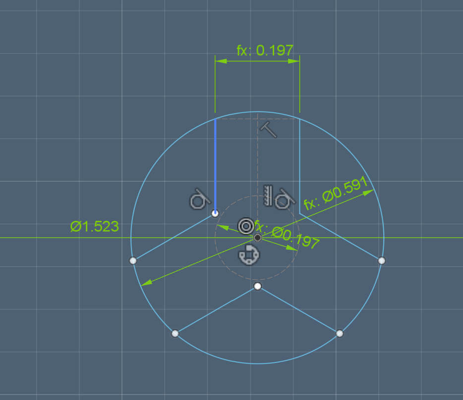

From this I created the axles and part of the motor shaft. I needed this axle to be able to be for the part that connected to each ground, the part that connected each crankshaft piece, the part that connected each linkage, and the part that was at the end of the half table.

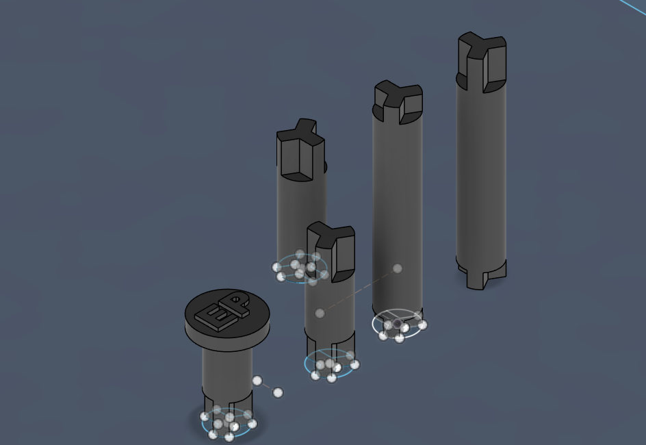

The axle peices weren't robust enough with base bambu file printing so I decided to increase the infil to 100% and also print them at a 45 degree angle so the force being apllied wasn't along the layers that the axle was printed on.

### Crank Web

Using the design I made the crankshaft pieces, creating the part of the crankshaft that didn't connect to the motor were simple. 

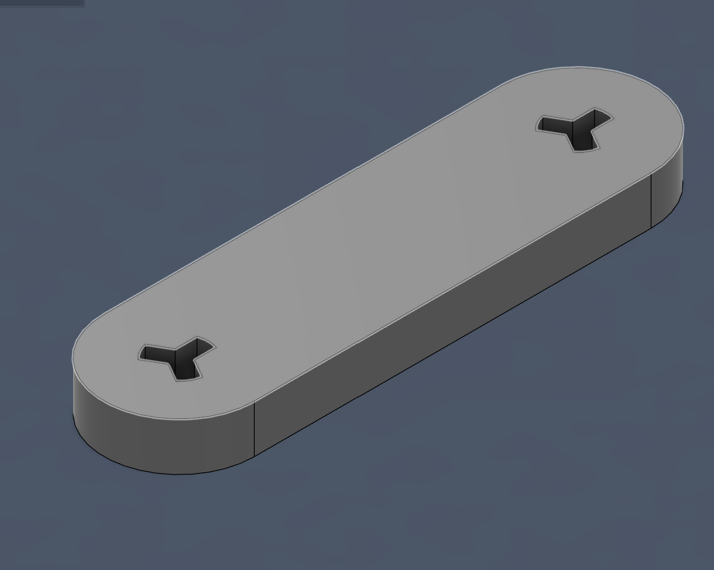

### Mounting Crank

The part that connected to the motor was a little more tricky though. At first I decided to extend the Crankweb piece I had so that it could fit the d-shaft for the motor and allowed a heat-insert to be placed in it so that I could have a set screw. 

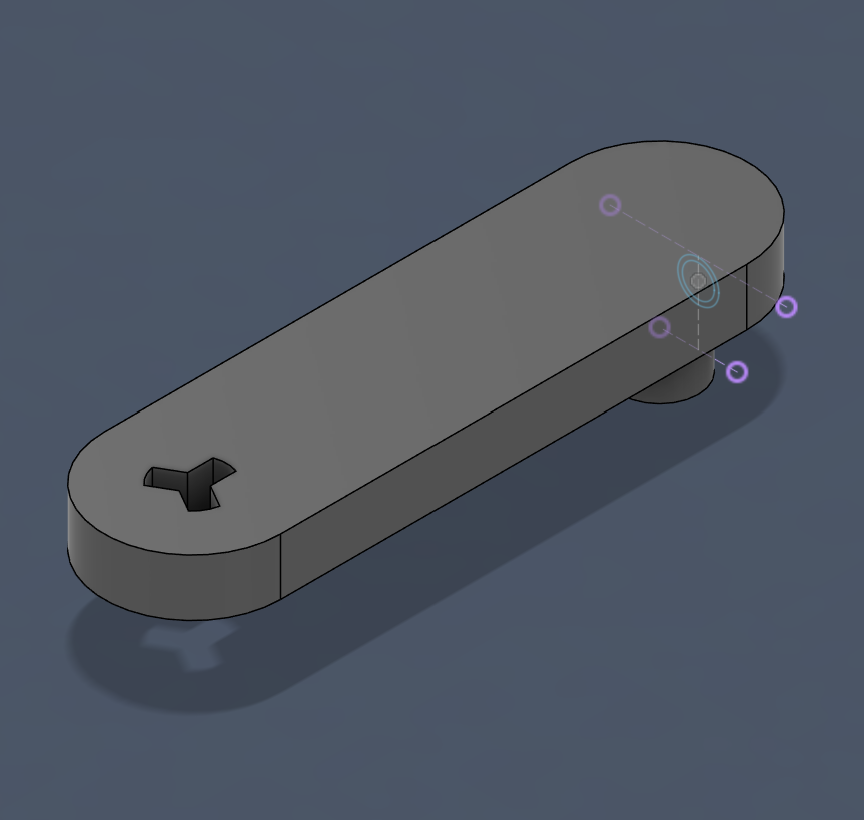

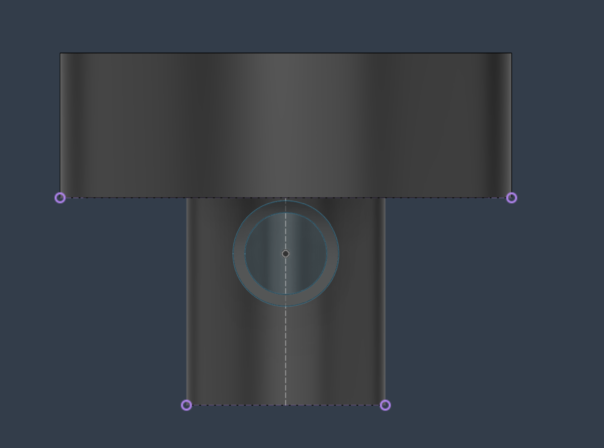

This didn't end up working as intended. The heat insert was not strong enough to hold the mounting crank onto the motor without failing. In order to fix this, I ordered motor flanges that allowed me to attach to the 3D printed. I redesigned the piece so it could house the flange using bolts and nuts.

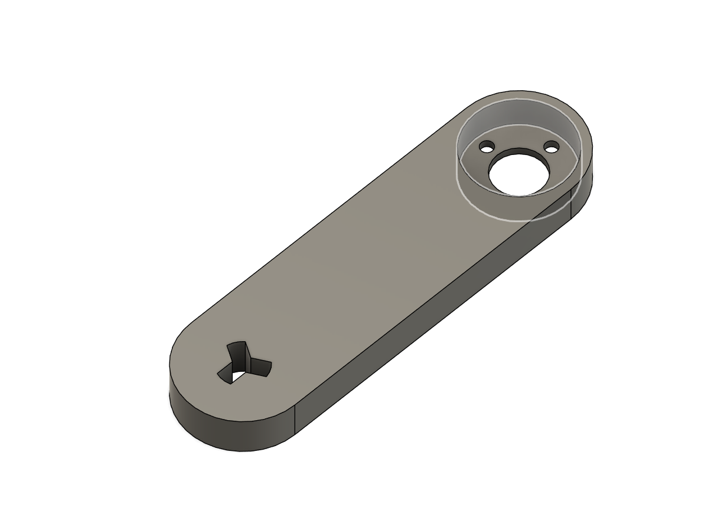

This design allowed the mounting crank to be strong enough to stay attached to the motor.

## Grounds

Now that the legs were finished, I moved onto the grounds.

I started a new sketch in Fusion 360 for my grounds. I decided to make larger holes in the grounds than I did before in order to cut off unesscessary weight that would put more load on the motor. I also added the slot holes that I would make 3D printed parts for eventually to connect each ground. For the middle I made sure to make a bearing shelf and a bearing through hole. By checking with my 3D model, it was easy to determine the height I would need for the grounds and how far out the slot holes would have to be so that the grounds would not interfer with the linkages.

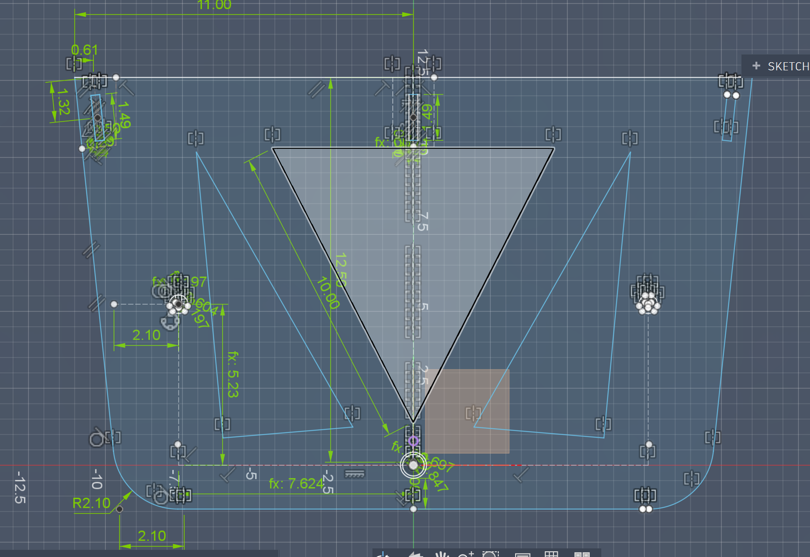

### Dividers

Today I decided to work on the 3D printed parts that would connect the grounds. By using the grounds I made yesterday as a schematic, I created the grounds.

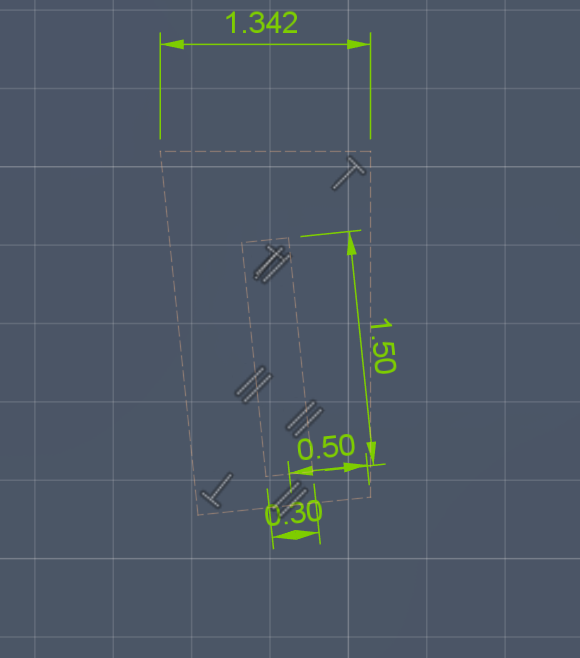

I then took this into a new file to create the 3D model. I had to make one for the end sides and one for the middle sides so that they can all fit together (the parts that go into it had to be full length and half length of wood and some had to be only half length).

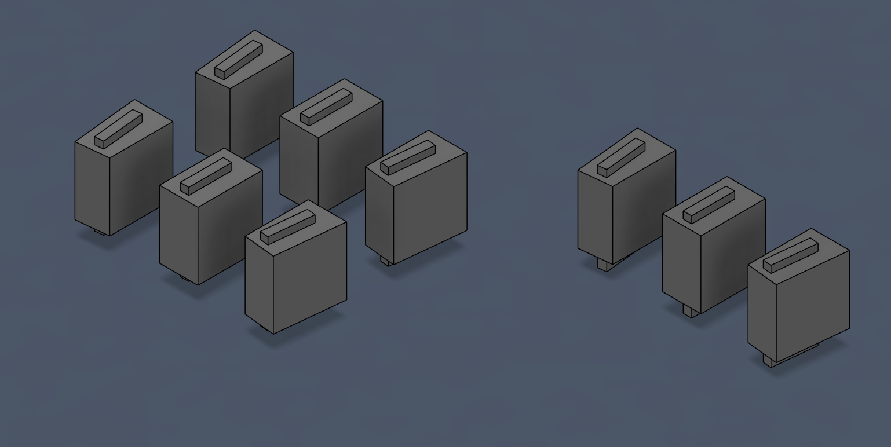

I had to add a fillet to the grounds as well because the milling machine cant make straight lines in inside pockets.

### Ground-Axle Connection

For the ground axle connection, I decided to do a fit test for the axles. From this, I deteremined an outer diameter of .604'' was the best fit for the grounds. So I changed my ground file to include this.

### Motor Connection Grounds

The ground that mounted the motor had to be slightly different because it had to accomadate for the mounting of the motor. I had to add holes for the motor screws with a bolt ledge so that I can fasten my motor to the ground.

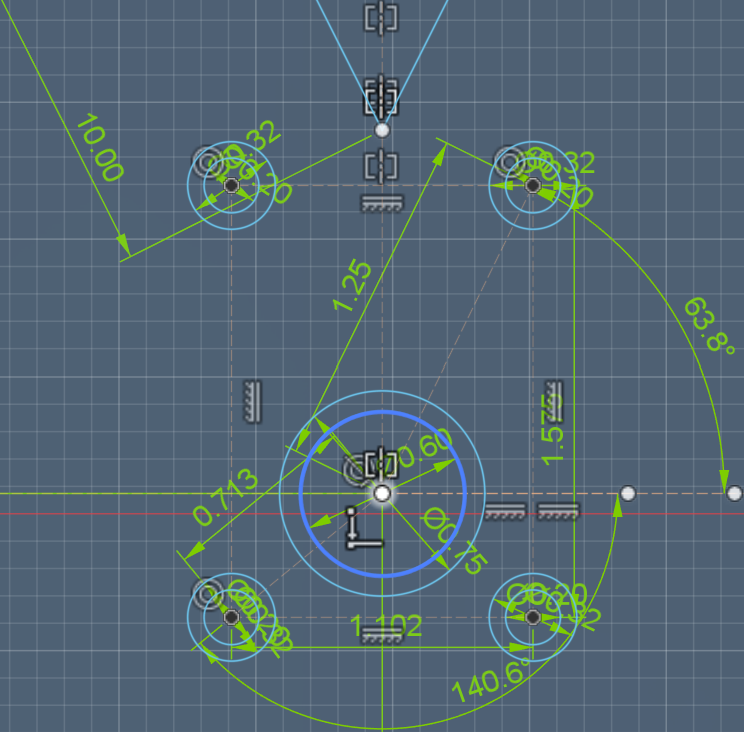

With that my grounds were completetd and I was ready to create the CNC files.

## Aspire

I took the dxfs of the files in Fusion360 and put them into Aspire. I had to join each of the pieces using the join tool and then I nested them. I set the material setup off machine bed. I was milling off a 96x48'' piece of plywood that was .5'' tall so I had the material setup accomadate that accordingly. Once this was done I selected each vector and assigned the drill paths accordingly.

The drill files for these files goes like so on a 1/2'' Plywood

3/8'' Compression Bit
- Bearing Shelf Pocket (.15'' Depth)
- Bolt Shelf Pocket (.34'' Depth)
- Bearing Shelf Pocket 2 (.41'' Depth) ; For the pieces that connect to the crankshaft
- Bearing Through Hole Pocket (.5'' Depth) 
- Half Pocket (.25'' Depth) ; For the pieces that connect to the crankshaft
- Inside Profile (.5'' Depth) ; For taking weight off feet, tabs included
- Outside Profile (.5'' Depth) ; tables included

1/4'' Straight Bit
- Bolt Hole

1/8'' Staight Bit
- Ground Hole

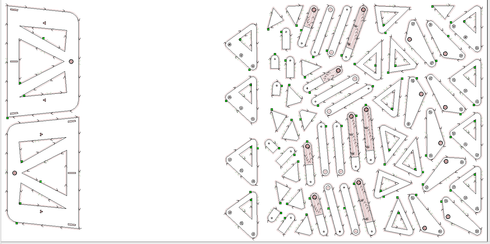

With that it was ready to mill. 

## Milling and Setting Up the Pieces

I fastend the plywood down to our ShopBot Large using composite nails and a brad gun. I then uploaded the drill file into the ShopBot software then milled the pieces.

I then proceded to glue the pieces together and add the bearings.

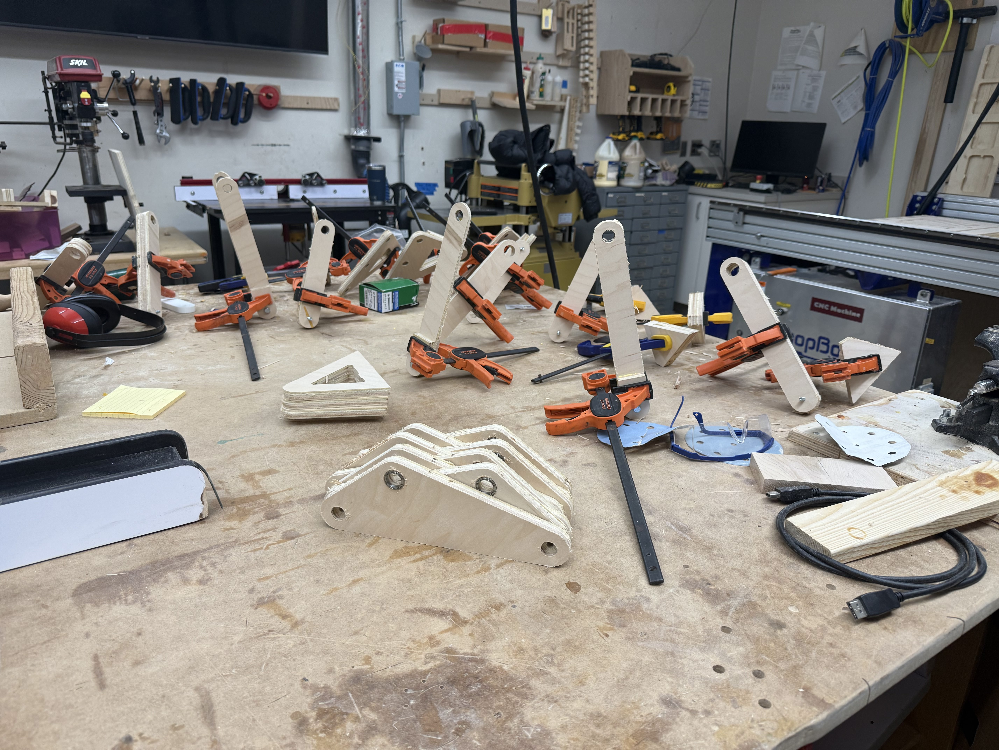

Now all of my pieces were ready to be put together to test one half of the table. During the time I was milling and gluing, I also 3D printed all the parts I needed using Bambu Slicer and our Bambu 3D printers.

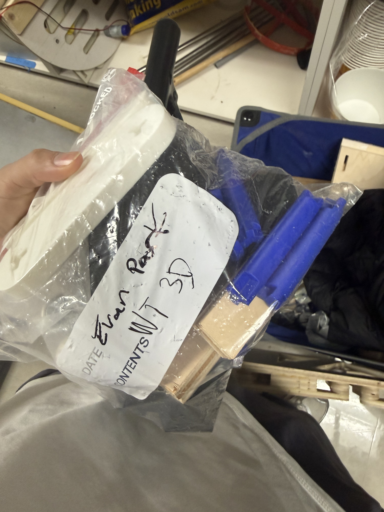

## Assembly

Now it was time to assemble the table.

### One Set

I mounted the motor onto the ground using bolts and then attach the ground axles. I then attech my motor crank shaft connector piece and set it in place using the set screw. I then attached the axles to the ground and crank webs using clamps. I then proceeded to attach the linkages onto the motor and then connected the next ground piece in order to keep everything in place and added the dividers. On the ends of the axles I also used spacers to reduce friction. Once this was done I tested it and it worked well. When I made a mistake with the spacing of the legs I take a crowbar and pry the axles off in order to make changes.

<video width="320" height="240" controls>
  <source src="..\docs\images\IMG_0782.mp4" type="video/mp4">
</video>

### Half Table

I then proceeded to attach the other two leg sets using the same process. While doing this, I made an error with the final piece by not adding spacers making the friction on it pretty bad making it hard for the legs to turn. At times, the half table could push off the ground and at other times it couldn't. This is as far I have made it up to the due date (3/7/26) of the documentation.

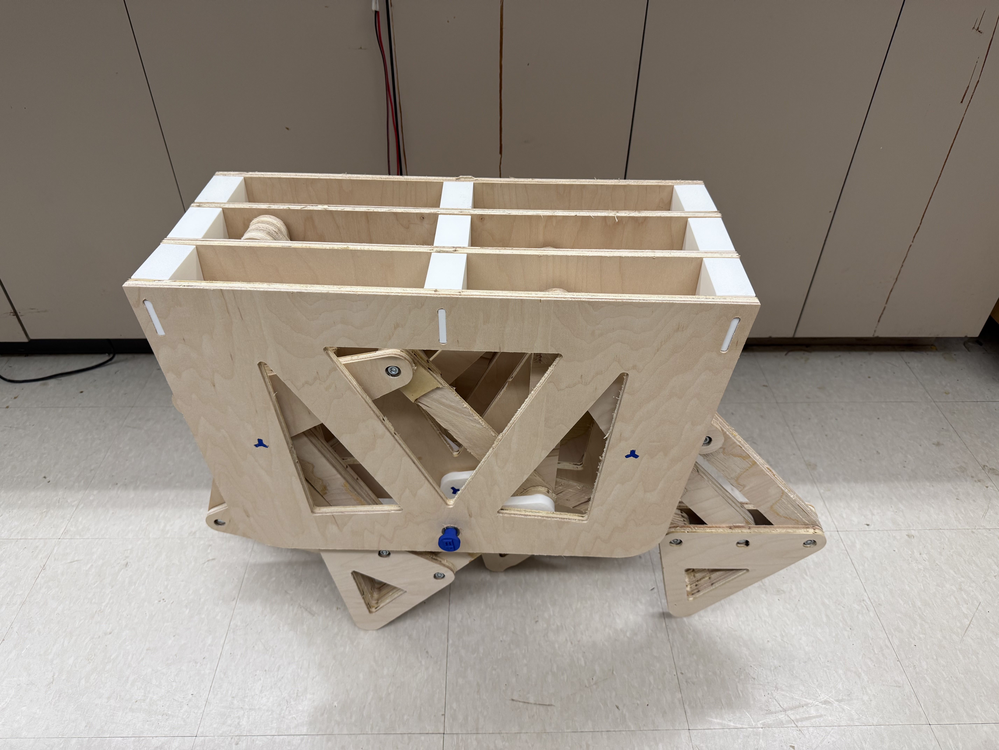

## Going Foward

I intend for this project to be completed soon. All of the changes that I have made to the table seem to have a great affect on it and makes it work better than it has before. If I can fix the friction on the last set of legs I'm sure I can get this walking soon. All there is left to do is to fix the issue with the friction and then replicating the process to one more half of the table and adding the table top. I will also add electronics by the end so it can be controlled remotely, and, with some help, I will try to incoorperate the camera tracking Collin Kanofsky and Kabir Nawaz made last year in order for the table to track people. I'm excited and pleased with the changed I have made and I'm excited to see this thing strolling across the hallways like a spider.

## Downloads

You can download all the files for my project [here](./downloads/ep-walkingtable-downloads.zip)

# Daily Journal (January - Current)

## January 5th & 6th

Today I did a bearing fit test for my legs so that I made sure I had the right diameter for a pressfit. I took the exact outer diameter (21 mm) and subtracted and added .25mm multiple times to test the different bearings. After milling I determined an outer diameter of 21.525mm was the perfect fit.

## January 7th & 8th

Today I started a new sketch in Fusion 360 for my grounds. I decided to make larger holes in the grounds than I did before in order to cut off unesscessary weight that would put more load on the motor. I also added the slot holes that I would make 3D printed parts for eventually to connect each ground. For the middle I made sure to make a bearing shelf and a bearing through hole. By checking with my 3D model, it was easy to determine the height I would need for the grounds and how far out the slot holes would have to be so that the grounds would not interfer with the linkages.

## January 9th & 12th

Today I decided to work on the 3D printed parts that would connect the grounds. By using the grounds I made yesterday as a schematic, I created the grounds.

I then took this into a new file to create the 3D model. I had to make one for the end sides and one for the middle sides so that they can all fit together (the parts that go into it had to be full length and half length of wood and some had to be only half length).

## January 13th & 15th

Looking at the Concept Bytes files, I decided to go with a 3D printed crankshaft as it would make it much easier for the legs to be at the correct phase and would make the issues that we had with the motor flanges go away. In order to create the flange I had to design the three pronged axle. I did this by creating an outer circle that was the thickness of the inner diameter of the bearings and then creating another circle conecntric to it that is a third of the length. I then created a chord that was a third of the diamter that was horizontal. From this I created two lines going out from each end of the chord chord tangent to the inner circle and made a circle pattern that repeated 3 times and forced the repeats of the lines to be coincident. 

## January 20th

From this I created the axles and part of the motor shaft. I needed this axle to be able to be for the part that connected to each ground, the part that connected each crankshaft piece, the part that connected each linkage, and the part that was at the end of the half table. 

## January 21st & 22nd

Using the design I made the crankshaft pieces. The part of the crankshaft that didn't connect to the motor were simple, but for the motor I needed to allow space for the d-shaft and an inset screw so that I can fasten the crankshaft to the motor.

## January 23rd & 26th

Today I created a spacer so that the legs wouldn't interfere with the ground which was a problem in our last iteration. This required me to change the axle 3D prints as well so that they were the correct lengths.

## January 27th - 30th

For the grounds, since they were milled and not 3D printed, I needed to do another fit test for them so that they would press fit with my 3D printed axles. I wasn't sure what exactly I should change for the file to make it fit so I decided to ask Claude which told me to just change the outside circle diamter. With this I determined the best fit for the axles had an outside diameter of 0.604'' With this I changed the ground sketch design so it matched with my fit test.

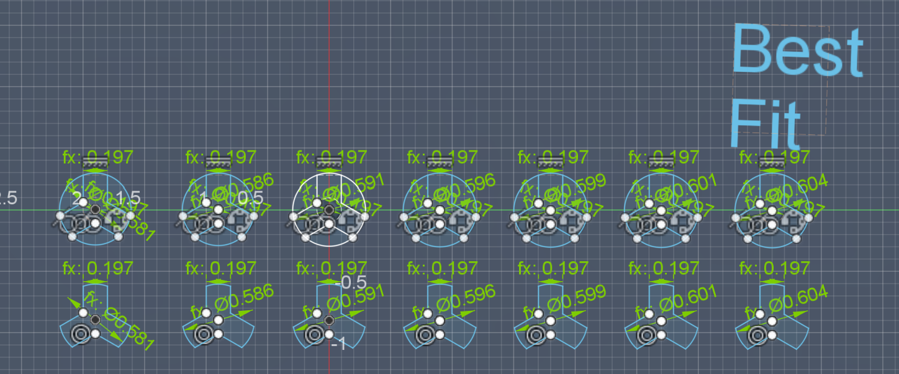

## Febuary 2nd

Today I designed my ground that would connect to my motor. This design wasn't much different from my other ground execpt for the fact that I had to add holes for the motor screws with a bolt ledge so that I can fasten my motor to the ground.

## Febuary 3rd

Today I did a test fit for the connecting pieces of my ground. Because the ShopBot cant drill straight lines on the inside of wood, I decided to make a fillet for my 3D printed pieces instead of adding a dogbone. From this I determined that a fillet of .05''

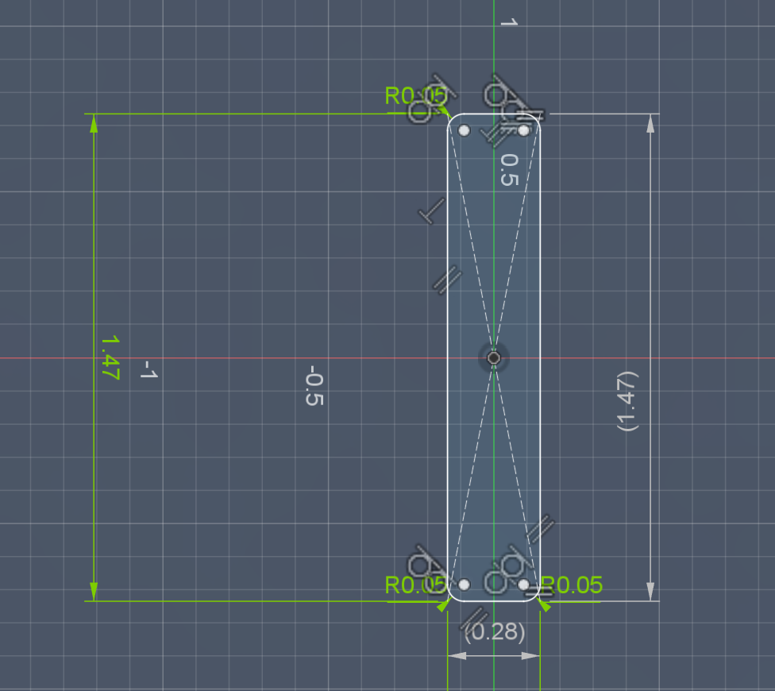

## Febuary 4th and 5th

Today I 3D printed a lot of my parts. This included crankshaft pieces, axles, and the ground connector pieces

## Febuary 6th and 9th

These days I redesigned my leg dxf file in Fusion360 to include bearings and bearing shelves. Using an offset I took uneeded weight off the feet.

## Febuary 11th and 18th

These days I took the dxf from Fusion 360 into Aspire in order to mill my legs. I created a file in order to mill a set of legs to test my motor flange and another Aspire file to mill the rest of the legs for 1/2 of the full table.

The drill files for these files goes like so on a 1/2'' Plywood

3/8'' Compression Bit
- Bearing Shelf Pocket (.15'' Depth)
- Bolt Shelf Pocket (.34'' Depth)
- Bearing Shelf Pocket 2 (.41'' Depth) ; For the pieces that connect to the crankshaft
- Bearing Through Hole Pocket (.5'' Depth) 
- Half Pocket (.25'' Depth) ; For the pieces that connect to the crankshaft
- Inside Profile (.5'' Depth) ; For taking weight off feet, tabs included
- Outside Profile (.5'' Depth) ; tables included

1/4'' Straight Bit
- Bolt Hole

1/8'' Staight Bit
- Ground Hole

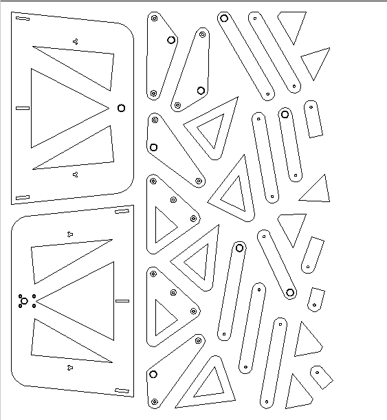

## Febuary 19th

Today I milled the leg set and some of the grounds.

## Febuary 20th

I accidentally forgot to mill the pieces that connect to the crankshaft halfway (so they can all fit in the middle without interacting with one another) so I had to mill again for those pieces.

## Febuary 23rd

Today I glued and sanded each piece. I made sure to put the bolts and axles through the pieces before I glued them so everything would line up when I put it together

IMAGE OF GLUED CLAMPED PIECES

## Febuary 24-25th 

Today I worked on the part of the crankshaft that would attach to the motor. At first, I decided that I would put a heat insert into a 3D print in order to create a set screw. I redesigned my motor connector and it seemed to spin fine.

## Febuary 26th - 27th

I milled the rest of my pieces and glued and sanded them using the same process as before.

## March 3rd

Today I put together one set of legs and I realized that the heat insert that I used for my 3D print motor crankshaft connection wasn't strong enough to put together the legs. So I ordered some motor flanges to come in the next day and I also redesigned the motor crankshaft piece so that the flange could fit in the 3D print.

## March 4th

With the new motor connector piece, I reassembled the legs and it worked.

## March 5th 

I put together the other two legs but was having issues because I made the last one too tight which made it so that there was too much friction and energy loss.

